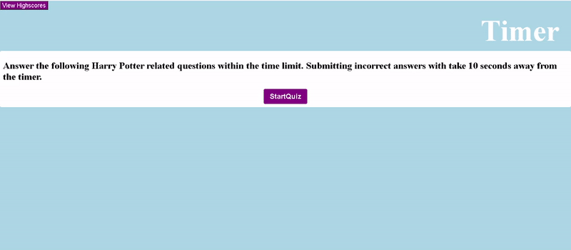

# JavaScriptCodeQuiz
This code dynamically creates questions and answers in the HTML through button generation.  

# Description
The challenge for the user is to enter in the most correct answers, in the shortest amount of time before the time runs out.  Incorrect answers penalize the user by 10 seconds per incorrect answer.  Theres a 1 second delay after receiving a correct or incorrect answer input. The code will also notify users if they've chosen the correct or incorrect answer. The code will dynamically create HTML/CSS depending on the users inputs. 
 
 The highscore sheet uses local web storage API whilst using javascript to achieve this.  Subtract time when submitting wrong answers. 

Client Comparison GIF
---

-------------------

This Applications Repository:
https://github.com/TheWintersFox/JavaScriptCodeQuiz

#Deployed application

https://thewintersfox.github.io/JavaScriptCodeQuiz/

The Deployed Application GIF
---

-------

#Validation Link
----
https://jigsaw.w3.org/css-validator/validator?uri=https%3A%2F%2Fthewintersfox.github.io%2FJavaScriptCodeQuiz%2F&profile=css3svg&usermedium=all&warning=1&vextwarning=&lang=en

#Reference's
----
https://www.youtube.com/watch?v=riDzcEQbX6k - Building a quiz with Javascript 
